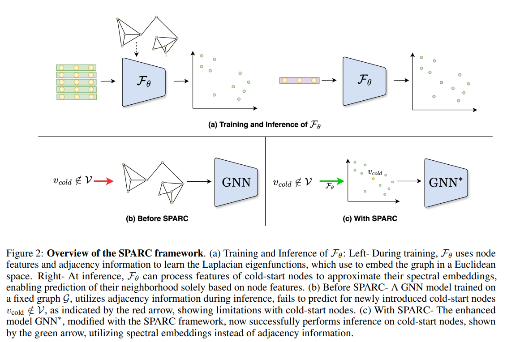

# SPARC: Spectral Architectures Tackling the Cold-Start Problem in Graph Learning

## Table of Contents
- [Overview](#overview)
- [Architecture Overview](#architecture-overview)
  - [SPARC Framework](#sparc-framework)
  - [SPARC Model Variants](#sparc-model-variants)
- [Features](#features)
- [Requirements & Installation](#requirements--installation)
  - [Input Format](#input-format)
- [Usage](#usage)
- [Citation](#citation)

## Overview
This is the official PyTorch implementation of SPARC from the paper "SPARC: Spectral Architectures Tackling the Cold-Start Problem in Graph Learning" [Paper](https://arxiv.org/abs/2411.01532).

SPARC is a novel graph learning framework designed to handle **cold-start nodes** using **generalizable spectral embeddings**.  
It enhances state-of-the-art graph models by enabling predictions on **new, unseen nodes** without adjacency information.

## Architecture Overview



### SPARC Framework
- Training Phase: The neural network learns spectral embeddings from adjacency-based Laplacian eigenfunctions.
- Inference Phase: Cold-start nodes are mapped to spectral space without adjacency information.

### SPARC Model Variants
- SPARC-GCN: Integrates spectral embeddings into GCN-based models.
- SPARCphormer: A transformer-based approach for large graphs.
- SAMBA: Utilizes state-space models for efficient graph learning.

## Features
- **Cold-Start Node Support**: Predicts on new nodes without retraining.
- **Scalable**: Works on large graphs.
- **State-of-the-Art Accuracy**: Outperforms baseline models on cold-start classification, clustering, and link prediction.

---

## Requirements & Installation

To set up SPARC, ensure you have installed Python 3.x. Then, install dependencies via:

```bash
pip install -r requirements.txt
```
Install [METIS](https://stackoverflow.com/questions/54326406/how-to-install-metis-library-for-python)

### Input Format
As input, the code requires that a graph is in GraphSAGE format, which specifies the following data files:

| File | Description |
|------|------------|
| `<train_prefix>-G.json` | NetworkX JSON file describing the graph. Nodes contain `val` and `test` attributes. |
| `<train_prefix>-id_map.json` | Maps graph node IDs to consecutive integers. |
| `<train_prefix>-class_map.json` | Maps graph node IDs to classes. |
| `<train_prefix>-feats.npy` (optional) | Numpy array of node features. If absent, identity features are used. |

## Usage

To use SPARC embeddings on graphs, `cd` to src directory and run the following:

```bash
python main.py config/cora|pubmed|citeseer|reddit|Amazon2M.json
```

To use one of the SPARC framework implementations, navigate to the respective directory and run the command, e.g.:
```bash
cd implementation/SPARCphormer
```

```bash
python train.py --dataset pubmed --batch_size 2000 --dropout 0.1 --hidden_dim 512 --hops 10  --n_heads 8 --n_layers 1 --peak_lr 0.001  --weight_decay=1e-05
```
---

## Citation

If you use SPARC in your research, please [cite](https://doi.org/10.48550/arXiv.2411.01532):

```
@article{jacobs2024g,
  title={G-SPARC: SPectral ARchitectures tackling the Cold-start problem in Graph learning},
  author={Jacobs, Yahel and Dayan, Reut and Shaham, Uri},
  journal={arXiv preprint arXiv:2411.01532},
  year={2024}
}
```