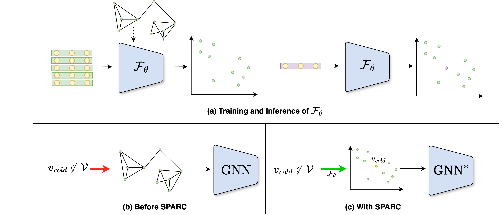

# SPARC: Spectral Architectures Tackling the Cold-Start Problem in Graph Learning

## Overview

SPARC is a novel graph learning framework designed to handle cold-start nodes using generalizable spectral embeddings. It enhances state-of-the-art graph models by allowing predictions on new, unseen nodes without adjacency information.

  

## Architecture Overview
### SPARC Framework
- Training Phase: The neural network learns spectral embeddings from adjacency-based Laplacian eigenfunctions.
- Inference Phase: Cold-start nodes are mapped to spectral space without adjacency information.

### SPARC Model Variants
- SPARC-GCN: Integrates spectral embeddings into GCN-based models.
- SPARCphormer: A transformer-based approach for large graphs.
- SAMBA: Utilizes state-space models for efficient graph learning.


## Features
- 📈 **Cold-Start Node Support**: Predicts on new nodes without retraining.
- 🚀 **Scalable**: Works on large graphs, including Amazon2M.
- 🏆 **State-of-the-Art Accuracy**: Outperforms baseline models on classification, clustering, and link prediction.

---

## 🔧 Requirements & Installation

To set up SPARC, ensure you have Python 3.x installed. Then, install dependencies via:

```bash
pip install -r requirements.txt
```
Install [METIS](https://stackoverflow.com/questions/54326406/how-to-install-metis-library-for-python)

#### Input format
As input, at minimum the code requires that a --train_prefix option is specified which specifies the following data files:

* <train_prefix>-G.json -- A networkx-specified json file describing the input graph. Nodes have 'val' and 'test' attributes specifying if they are a part of the validation and test sets, respectively.
* <train_prefix>-id_map.json -- A json-stored dictionary mapping the graph node ids to consecutive integers.
* <train_prefix>-class_map.json -- A json-stored dictionary mapping the graph node ids to classes.
* <train_prefix>-feats.npy [optional] --- A numpy-stored array of node features; ordering given by id_map.json. Can be omitted and only identity features will be used.

## Usage

To use GraphSpectralNet on Cora, Pubmed, or the citeseer dataset, `cd` to src directory and run the following:

```bash
python main.py config/cora|pubmed|citeseer.json
```

@article{jacobs2024g,
  title={G-SPARC: SPectral ARchitectures tackling the Cold-start problem in Graph learning},
  author={Jacobs, Yahel and Dayan, Reut and Shaham, Uri},
  journal={arXiv preprint arXiv:2411.01532},
  year={2024}
}